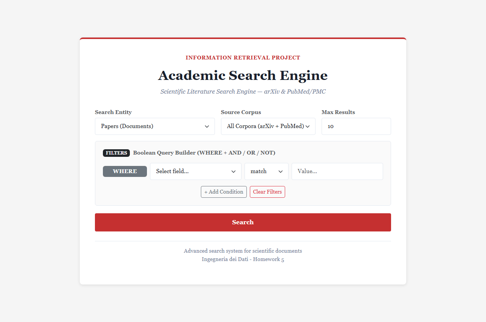
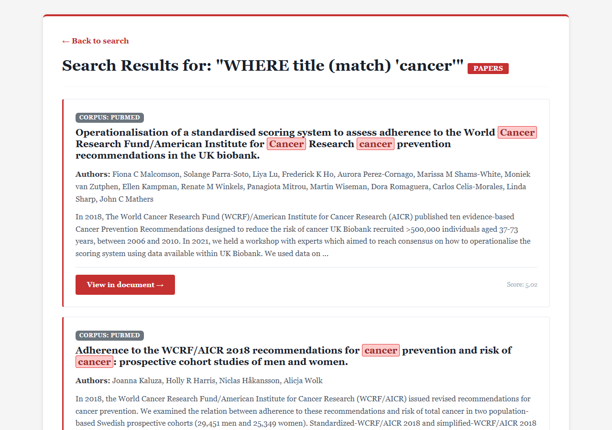
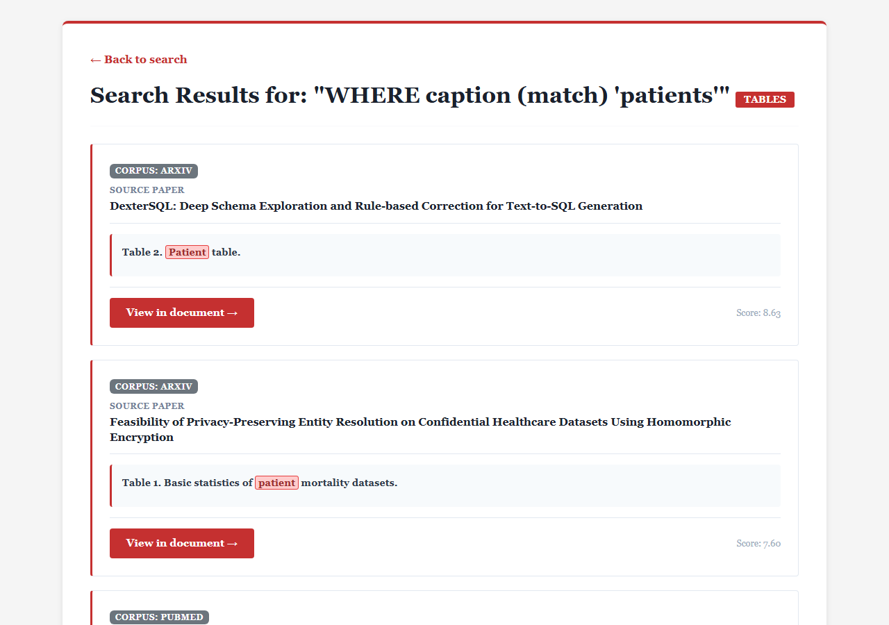
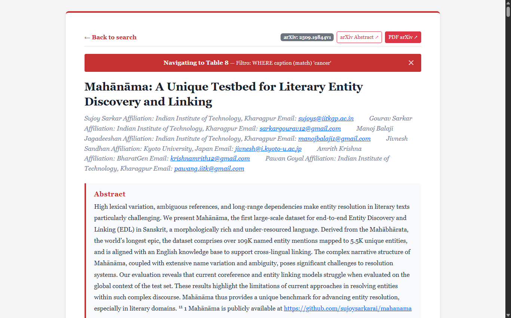
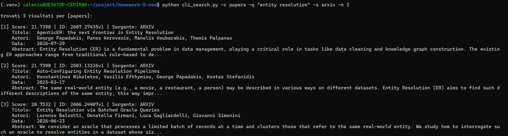

# Academic Search Engine — HW5 (Ingegneria dei Dati)

[](https://www.elastic.co/)
[](https://fastapi.tiangolo.com/)
[](#)
[](#)
[](#)

Motore di ricerca accademico full-text e booleano ad alte prestazioni basato su **FastAPI** ed **Elasticsearch 8.x**, progettato per l'esplorazione avanzata di articoli scientifici da due sorgenti eterogenee: **arXiv** e **PubMed Central (PMC)**, con estrazione e indicizzazione di primo livello di **tabelle** e **figure** con arricchimento contestuale.

---

## Indice

- [Panoramica e Obiettivi](#panoramica-e-obiettivi)
- [Galleria e Dimostrazione Visiva (Web & CLI)](#galleria-e-dimostrazione-visiva-web--cli)
- [Architettura e Struttura Simmetrica](#architettura-e-struttura-simmetrica)
- [Pipeline di Elaborazione e Scelte Metodologiche](#pipeline-di-elaborazione-e-scelte-metodologiche)
- [Requisiti e Installazione](#requisiti-e-installazione)
- [Avvio Rapido (Server Web, CLI, Pipeline)](#avvio-rapido-server-web-cli-pipeline)
- [Guida alla Ricerca (Web & CLI)](#guida-alla-ricerca-web--cli)
- [Riferimento API (FastAPI)](#riferimento-completo-api-fastapi)
- [Valutazione Sperimentale e Benchmark IR](#valutazione-sperimentale-e-benchmark-ir)

---

## Panoramica e Obiettivi

L'obiettivo dell'Homework 5 è sviluppare un sistema di Information Retrieval end-to-end su pubblicazioni scientifiche provenienti da due sorgenti primarie:
1. **PubMed Central (PMC)**: letteratura biomedica in formato JATS XML / HTML strutturato (705 paper indicizzati).
2. **arXiv**: letteratura scientifica di informatica e data engineering con versione HTML ufficiale (505 paper indicizzati).

Il sistema tratta documenti, tabelle e figure come entità di prima classe con indici Elasticsearch dedicati (`papers_index`, `tables_index`, `figures_index`), supportando sia ricerche testuali libere sia query booleane complesse (WHERE, AND, OR, NOT) con ranking BM25 ottimizzato.

---

## Galleria e Dimostrazione Visiva (Web & CLI)

### 1. Interfaccia Web — Ricerca Unificata & Costruttore Booleano
L'interfaccia principale offre un costruttore dinamico di query che permette di cercare in modalità Full-Text su tutto il documento oppure filtrare per campi specifici (`title`, `authors`, `abstract`, `published`), concatenando clausole logiche e selezionando il corpus di interesse (**Tutti i Corpus**, **Solo arXiv**, **Solo PubMed / PMC**):



---

### 2. Risultati Documenti — Ranking, Snippet e Deep Linking
I risultati restituiti evidenziano punteggio di rilevanza BM25, sorgente (`ARXIV` o `PUBMED`), autori, data, abstract con evidenziazione e link diretti ai documenti e agli elementi multimediali correlati:



---

### 3. Risultati Tabelle — Caption, Schema Tabellare e Paragrafi di Contesto
La ricerca su tabelle interroga congiuntamente didascalia, corpo strutturato della tabella, citazioni nel testo (*mentions*) e paragrafi in cui la tabella viene commentata dall'autore:



---

### 4. Visualizzatore Paper — Scroll Automatico ed Evidenziazione
Cliccando su un risultato, il visualizzatore apre il paper completo e posiziona automaticamente il viewport sull'elemento ricercato, applicando l'evidenziazione ai termini pertinenti:



---

### 5. Interfaccia da Linea di Comando (CLI)
Il sistema è interamente fruibile da terminale tramite `cli_search.py`, sia in **modalità interattiva** (`python cli_search.py -i`) sia tramite **argomenti CLI** per interrogare documenti, tabelle e figure:



---

## Architettura e Struttura Simmetrica

Il progetto adotta un'organizzazione simmetrica e pulita del filesystem:

```text
Homework-5-new/
├── pubmed/                       # Dataset PubMed Central (PMC)
│   ├── corpus.json               # 705 paper completi
│   ├── tables_with_context.json  # 1.674 tabelle con contesto
│   └── figures_with_context.json # 1.179 figure con contesto
├── arxiv/                        # Dataset arXiv (500+ paper con HTML reale)
│   ├── corpus.json               # 505 paper verificati con HTML completo
│   ├── tables_with_context.json  # 3.541 tabelle estratte
│   └── figures_with_context.json # 2.404 figure estratte
├── corpus.json -> pubmed/corpus.json                 # Symlink root retrocompatibile
├── tables_with_context.json -> pubmed/...           # Symlink root retrocompatibile
├── figures_with_context.json -> pubmed/...          # Symlink root retrocompatibile
├── app/                          # Core applicativo
│   ├── business/
│   │   ├── corpus_builder/       # Client di acquisizione API (arXiv e PubMed)
│   │   ├── extractor/            # Estrazione tabelle, figure, caption e contesto
│   │   └── indexer/              # Indicizzatori Elasticsearch dedicati (papers, tables, figures)
│   ├── config/                   # Configurazione centralizzata (.env, query di gruppo)
│   ├── services/routes.py        # Controller FastAPI (Web UI, Search, Task API multi-source)
│   └── utils/                    # Parsing date, pulizia testo e gestione immagini
├── docs/images/                  # Screenshot dell'interfaccia Web e della CLI
├── experiments/                  # Valutazione sperimentale IR (MAP, nDCG@10, MRR, Precision@K)
├── templates/                    # Template HTML Jinja2 (index.html, results.html, paper.html)
├── scripts/                      # Script batch e utility di indicizzazione
│   ├── index_all.py              # Script unificato per reindicizzare entrambi i corpus (10.008 entità)
│   ├── pipeline_arxiv.py         # Pipeline arXiv batch con supporto --limit 500
│   └── pipeline_pubmed.py        # Pipeline PubMed batch su pubmed/
├── cli_search.py                 # Shell CLI di ricerca interattiva e scriptabile (Requisiti 3 e 8)
├── RISULTATI.md                  # Relazione tecnica, benchmark e 10 query di esempio
└── run.py                        # Entry point server Web Uvicorn
```

---

## Pipeline di Elaborazione e Scelte Metodologiche

1. **Acquisizione arXiv Conforme alla Consegna**:
   - Poiché i paper del solo Gruppo A in tutta la storia di arXiv contavano 396 paper totali (molti pre-2023 privi di HTML), la ricerca è stata estesa a tutti i gruppi ufficiali della traccia (Entity Resolution, Text-to-SQL, Speech Recognition, Text to Speech, Query Optimization).
   - Verifica rigorosa di risposta HTTP 200 da `https://arxiv.org/html/<id>`.
   - Download multi-thread parallelo con 6 worker e rispetto del rate-limiting API.
2. **Estrazione Tabelle & Figure con Arricchimento**:
   - Supporto a numeri arabi, romani (`Table I`, `IV`) e supplementari (`Table S1`).
   - Risoluzione delle collisioni con identificativi univoci compositi.
   - Ponderazione dei paragrafi di contesto tramite overlap di termini informativi al netto delle stopwords.
   - Normalizzazione corretta dei link alle immagini sia per PMC (`pmc.ncbi.nlm.nih.gov`) sia per arXiv (`arxiv.org`).
3. **Mapping Elasticsearch Ottimizzato**:
   - `html_content` escluso dall'inverted index (`index: false`), risparmiando oltre 120 MB di RAM/disco.
   - Aggiunto subfield `.keyword` su `authors` e `title` per ricerche esatte.
   - Analyzer unificato a `english` su tutti i campi testuali per garantire coerenza nello stemming.
   - `number_of_replicas: 0` per cluster single-node, garantendo cluster health **GREEN**.

---

## Requisiti e Installazione

- **Python**: 3.14+ 
- **Elasticsearch**: 8.x attivo su `https://localhost:9200`

```bash
# clone del repository
git clone https://github.com/SilContemori/Homework-5-new.git
cd Homework-5-new

# ambiente virtuale
python3 -m venv .venv
source .venv/bin/activate  # su Windows: .venv\Scripts\Activate.ps1

# installazione dipendenze
pip install -r requirements.txt
```

Configura `.env` nella root del progetto:
```ini
HOST_ELASTIC=https://localhost:9200
PASSWORD_ELASTIC=tua_password_elasticsearch
SOURCE=all
NCBI_API_KEY=<tuo_api_key>
DELAY=1.5
```

---

## Avvio Rapido (Server Web, CLI, Pipeline)

### 1. Avvio della Web Application
```bash
python run.py
```
Accedi all'interfaccia all'indirizzo [http://localhost:8080](http://localhost:8080) e alla documentazione interattiva OpenAPI su [http://localhost:8080/docs](http://localhost:8080/docs).

### 2. Ricerca da Linea di Comando (CLI)
```bash
# modalità interattiva con menu a scelte
python cli_search.py -i

# ricerca rapida documenti su arXiv
python cli_search.py -c papers -q "entity resolution" -s arxiv -n 3

# ricerca tabelle con contesto
python cli_search.py -c tables -q "precision recall f1" -n 2

# ricerca booleana avanzata
python cli_search.py -c papers -q "coffee AND cancer NOT smoking" -m boolean -n 3
```

### 3. Esecuzione della Reindicizzazione Unificata
Per sincronizzare o ricostruire tutti gli indici di Elasticsearch con un singolo comando:
```bash
python scripts/index_all.py
# oppure direttamente tramite la CLI di ricerca:
python cli_search.py --index-all
```

---

## Guida alla Ricerca (Web & CLI)

L'interfaccia unificata supporta tutte le modalità previste dal **Requisito 3** della traccia:

- **Filtro Sorgente**: seleziona `Tutti i Corpus`, `Solo arXiv` o `Solo PubMed / PMC`.
- **Ricerca Full-Text**: impostando il campo su `full_text` (o lasciando `Campo...`), il motore esegue un `multi_match` ponderato (`title^3`, `abstract^2`, `full_text`, `authors`).
- **Ricerca per Singolo Campo**: permette di vincolare la ricerca a `title`, `abstract`, `authors`, `published`, `paper_id`.
- **Clausole Booleane**: consente di aggiungere condizioni dinamiche con `WHERE`, `AND`, `OR`, `NOT`.
- **Operatori di Confronto**: `match` (fuzzy standard), `phrase` (sequenza esatta), `term` (valore esatto su keyword).

---

## Riferimento API (FastAPI)

La documentazione interattiva è accessibile a server avviato su **`http://localhost:8080/docs`** (Swagger UI).

### 1. Ricerca & Web UI
- `GET /` — Home page con form di ricerca.
- `GET /search` — Esegue la ricerca su paper, tabelle o figure (filtri per campo e operatori booleani).
- `GET /paper/{paper_id}` — Mostra l'HTML del paper ed evidenzia elementi cercati (`?table=...`, `?figure=...`, `?query=...`).

### 2. Pipeline & Background Tasks
Tutti i task accettano il parametro opzionale `source` (`"all"`, `"arxiv"`, `"pubmed"`):
- `POST /api/tasks/corpus/build` — Scarica i paper in HTML da arXiv o PubMed.
- `POST /api/tasks/extract/tables` — Estrae le tabelle con contesto e menzioni.
- `POST /api/tasks/extract/figures` — Estrae le figure con didascalie e contesto.
- `POST /api/tasks/index/papers` — Indicizza i paper su Elasticsearch.
- `POST /api/tasks/index/tables` — Indicizza le tabelle su Elasticsearch.
- `POST /api/tasks/index/figures` — Indicizza le figure su Elasticsearch.
- `POST /api/tasks/index/all` — Indicizzazione unificata completa di entrambi i corpus (10.008 entità).
- `GET /api/tasks/status` — Verifica la presenza dei file JSON su disco.
- `GET /api/tasks/{task_id}` — Controlla lo stato di avanzamento di un task in background.

### 3. Redirect Link Esterni (PMC e arXiv)
Nei paper HTML scaricati sono presenti link relativi (es. `/articles/...`, `/pdf/...`). Questi endpoint evitano errori 404 e reindirizzano direttamente ai portali ufficiali di PubMed Central e arXiv.

---

## Valutazione Sperimentale e Benchmark IR

Il sistema è stato valutato formalmente su un dataset bilanciato con metriche di Information Retrieval rigorose:

- **Cluster Health**: **GREEN**
- **Documenti Totali**: **1.210** (705 PubMed + 505 arXiv)
- **Tabelle Totali**: **5.241** (1.700 PubMed + 3.541 arXiv)
- **Figure Totali**: **3.499** (1.095 PubMed + 2.404 arXiv)
- **Totale Entità Indicizzate**: **9.950**

### Sintesi delle Prestazioni

| Categoria | Modalità | MAP | nDCG@10 | MRR | Precision@5 | Latenza Media |
|---|:---:|:---:|:---:|:---:|:---:|:---:|
| **Papers** | Full-Text | 0.6225 | 0.7116 | 0.9333 | 0.6800 | 289.7 ms |
| **Papers** | Booleana | 0.6645 | 0.7328 | 0.9333 | 0.7000 | 240.9 ms |
| **Tables** | Booleana | 0.2577 | 0.5494 | 0.7305 | 0.5200 | 15.5 ms |
| **Figures** | Booleana | 0.3984 | 0.6975 | 0.7917 | 0.5600 | 10.9 ms |

Per la relazione tecnica integrale, i tempi di indicizzazione dettagliati e l'esecuzione analitica delle 10 query di esempio (arXiv vs PubMed):
**[Consulta il documento RISULTATI.md](RISULTATI.md)**
